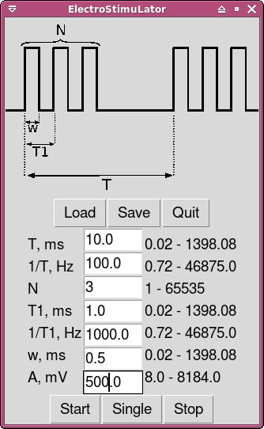

# x-SLON firmware and guiSLON

This software is designed for work with [x-SLON devices](https://github.com/comcon1/x-SLON).  

Device is very small and is assembled simply. Please consult [assembly.txt](case/assembly.txt).

**Control software _guiSLON_**

The GUI and the library lives in a single file _ESL.py_. 

The main window of _guiSLON_ is shown in the Figure. The program has a simple interface and allows 
a user to set a pulse period, pulse width, number of pulses per train and train period.
The user can select between single pulse train and periodic pulse trains by pressing either the “Single” or the "Start" button.

# Authors

Ilya Kuzmin <kuzmin.ilya@gmail.com>  
Peter Mamonov <pmamonov@gmail.com>  
Alexey Nesterenko <comcon1@protonmail.com>  

# Licensing

"x-SLON firmware and guiSLON" project (I. Kuzmin, P. Mamonov, A. Nesterenko)
is released under license CC BY-SA 3.0.
